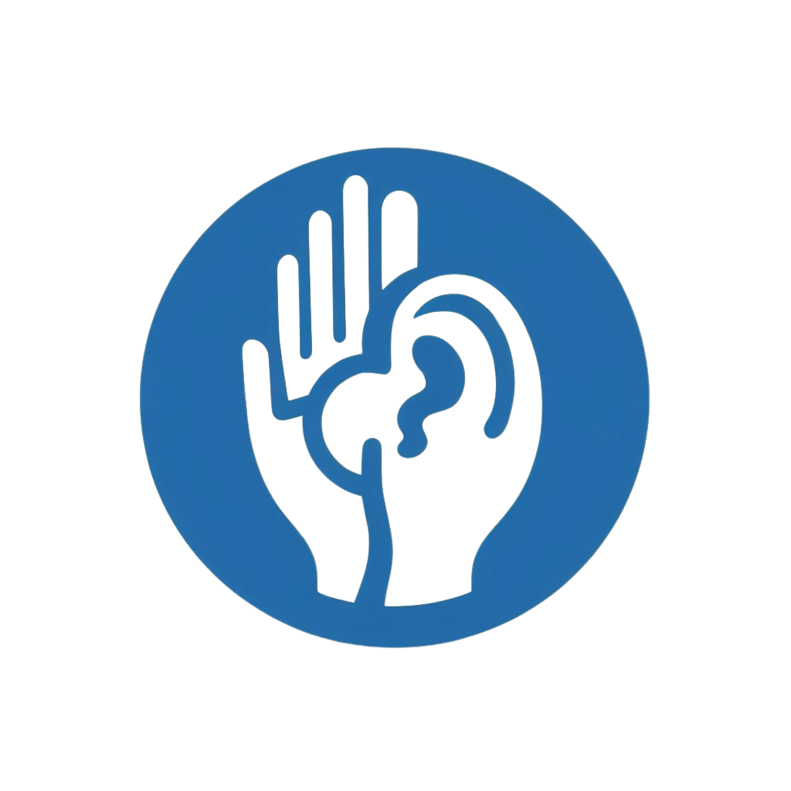

    
    <h1><strong>Motion Sign</strong></h1>
    

    Sign Translate Language Transalate App powered by machine learning. 
    This is a project to fulfill the  <a href="https://grow.google/intl/id_id/bangkit/"><strong>Bangkit Academy led by Google, GoTo, & Traveloka »</strong></a> Program.
    

 
 

## Table of Content
* [About the Project](#about-the-project)
* [Documentation](#documentation)
* [Usage](#usage)
* [Feature](#feature)
* [Capstone Project Teams](#capstone-project-teams)

## About the Project
Motion Sign is an Sign Language Translation App. Motion Sign is inspired from Hear Me by PT. Inovasi Disabilitas Indonesia. Imagine a world where being unable to hear doesn't mean being unable to communicate with everyone. This is the vision behind the Motion Sign app.

## Documentation
Here are links to documentation of some of the learning paths that make up this app:
* [Machine Learning Documentation](https://github.com/handayaniarum/motionsign-ml)
* [Mobile Development Documentation](https://github.com/nurarifin12/MotionSign)
* [Cloud Computing Documentation](https://github.com/)
